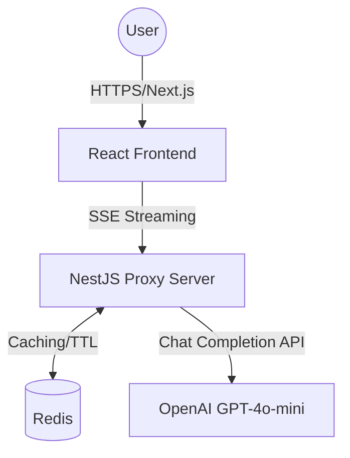
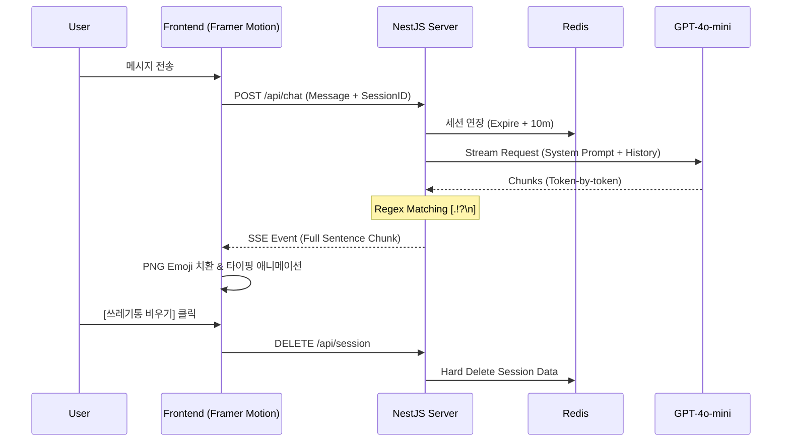

# 🛠 Technical Requirements Document (TRD): 감바쓰 (Gambass) v1.0

## 1. Executive Summary & Context

* **Vision:** 사용자가 로그인 없이 즉각적으로 감정을 배설하고, 데이터를 완벽히 파기함으로써 심리적 해방감을 제공하는 휘발성 웹 서비스.
* **User Personas:** 학업, 직장, 인간관계에서 오는 스트레스를 익명으로 빠르게 해소하고 싶은 1020 세대.
* **Goals:**
    * 0.5초 이내의 빠른 응답 체감 (P90 < 500ms).
    * 친구 같은 거친 페르소나의 완벽한 구현.
    * 브라우저 종료 전까지 유지되는 견고한 세션 관리.
* **Non-Goals:** 회원가입 및 소셜 로그인, 대화 로그의 영구 저장, 다중 페르소나 지원.

## 2. System Architecture & Flow

### 2.1 High-Level Architecture
시스템은 확장성과 개발 속도를 위해 **NestJS (BFF)**와 **Redis (Session Storage)** 조합을 채택합니다.



### 2.2 Sequence Diagram: Real-time Venting Flow
SSE를 활용하여 문장 단위로 끊어 보내는 핵심 로직의 흐름입니다.



## 3. Functional Requirements

| ID | Requirement | Success Metrics | Edge Cases |
| :--- | :--- | :--- | :--- |
| **FR-1** | **GPT-4o-mini 기반 페르소나** | 토큰당 생성 속도 < 20ms | 부적절한 요청 시 "나 바쁘니까 나중에 해" 식의 거절 응답 |
| **FR-2** | **SSE 문장 단위 스트리밍** | 문장 끝 감지 후 100ms 이내 전송 | 마침표 없는 긴 문장의 경우 50자 기준 강제 절단 |
| **FR-3** | **슬라이딩 세션 관리** | 상호작용 시 TTL 10분 자동 갱신 | 탭 종료 후 재접속 시 LocalStorage 기반 복구 성공 |
| **FR-4** | **포스트잇 애니메이션** | 모바일 브라우저 60fps 유지 | 저사양 기기에서 애니메이션 생략 및 단순 Fade-in 처리 |

## 4. Data & API Design

### 4.1 Data Model (Redis)
* **Key:** `session:{sessionId}`
* **Value (JSON):** 
```json
    {
      "messages": [
        {"role": "user", "content": "진짜 짜증나"},
        {"role": "assistant", "content": "와 미친거아냐? :angry:"}
      ],
      "lastActive": "2024-04-16T16:00:00Z"
    }
```
* **Strategy:** `SETEX`를 사용하여 10분 TTL(Time-to-Live) 설정.

### 4.2 API Specification
* **`POST /api/chat`**: 유저 메시지 수신 및 SSE 스트림 시작.
* **`DELETE /api/session`**: Redis 데이터 삭제 및 세션 종료.
* **`GET /api/session/check`**: 기존 세션 유효성 확인.

## 5. Non-Functional Requirements (Quality Specs)

* **Performance:**
    * **P90 Latency:** 첫 번째 문장 노출까지 500ms 이내.
    * **Max TPS:** 최소 10명의 동시 세션 처리 (Node.js Event Loop 최적화).
* **Security:**
    * **Rate Limiting:** IP당 분당 20회 요청 제한 (Redis 기반 Throttling).
    * **Prompt Injection:** 시스템 프롬프트 유출 방지를 위한 입력값 필터링.
* **UI/UX (Mobile First):**
    * **Framer Motion:** 포스트잇 드래그 및 구겨짐 효과 구현.
    * **Emoji Mapping:** 텍스트 내 `:angry:` 등의 토큰을 클라이언트 `/public/images/emojis/` 내 PNG 파일로 매핑.

## 6. Infrastructure & Deployment

* **Runtime:** Node.js 20.x (NestJS Framework).
* **Infrastructure:** * **Backend:** AWS App Runner (배포 편의성) 또는 Docker 기반 EC2.
    * **Frontend:** Vercel (Next.js 최적화).
    * **Database:** Managed Redis (Upstash 또는 AWS ElastiCache).
* **CI/CD:** GitHub Actions를 통한 자동 배포 파이프라인 구축.
